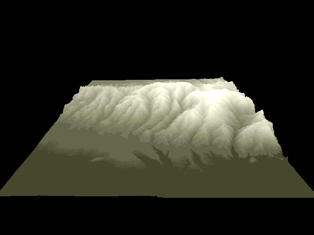

#Height Field Generator

LMB - Rotate Camera
Shift + LMB - Scale
CTRL + LMB - Translate

Rendering Mode
1 - Shaded
2 - Wireframe
3 - Point Cloud
4 - Wireframe on Shaded

Rendering Quality
0 - Ultra
9 - High
8 - Medium
7 - Low

To compile: `make`
This assumes that there is a pic directory one level above

To run: `./heightField [HEIGHTMAPIMAGEFILENAME]`